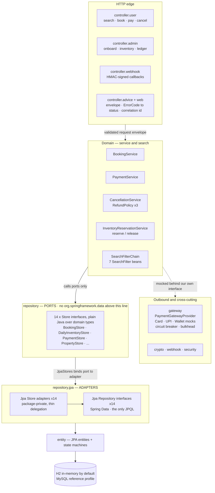
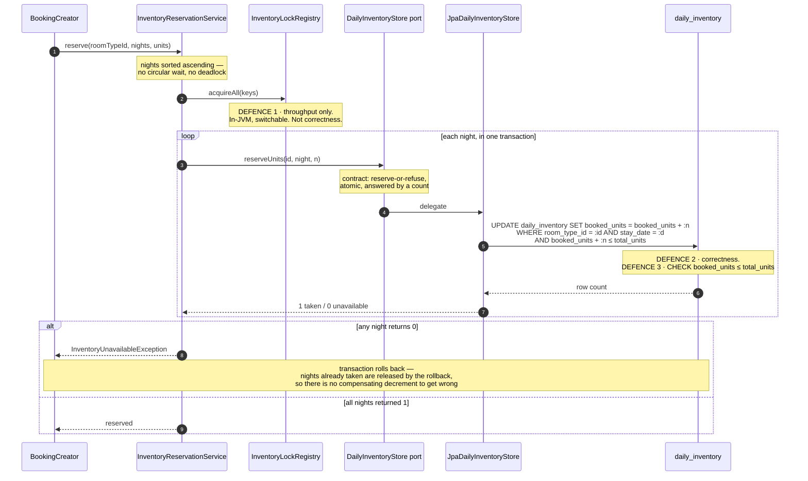
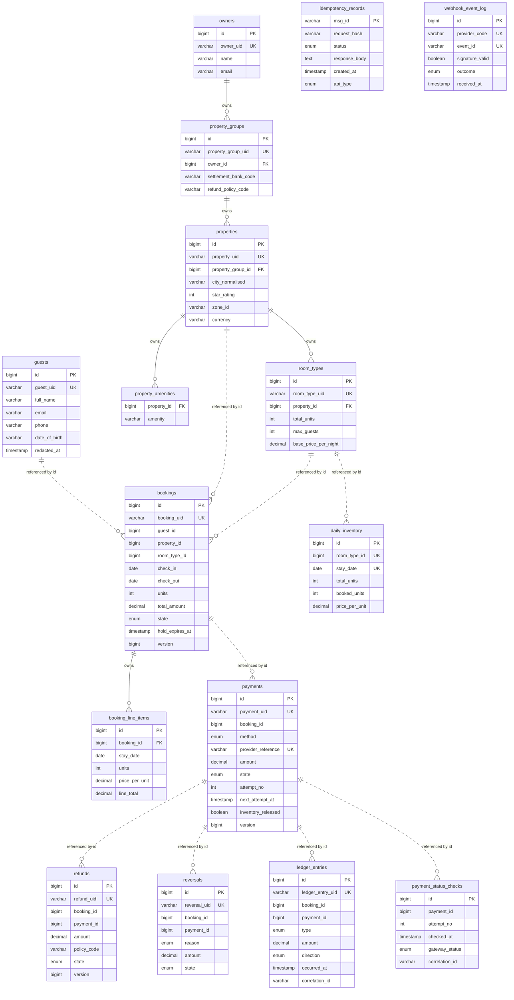
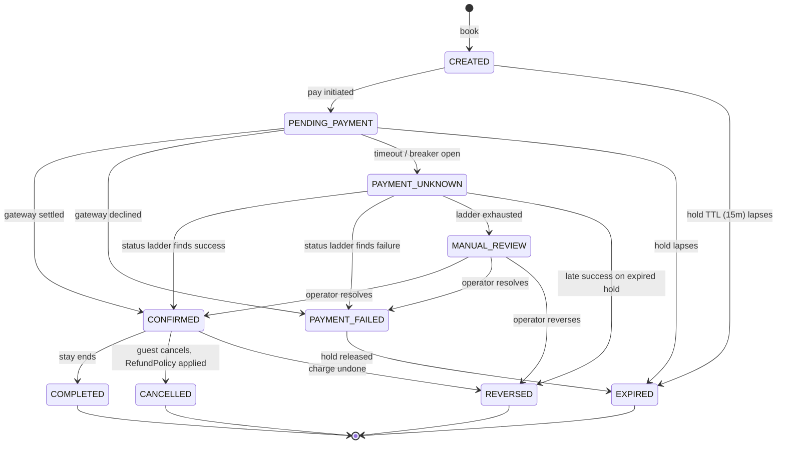

# Architecture and schema

Diagrams for the hotel booking service. Every box, column and constraint below is read out of the
code in this repository, not sketched from an intended design — the JPA annotations are the single
source of truth for the schema (`ddl-auto: create-drop` generates it at startup), so a table here
that disagrees with `src/main/java/com/umesh/hotelbooking/entity` is a bug in this file.

Diagrams are [Mermaid](https://mermaid.js.org) and render inline on GitHub. A styled standalone
version of the same four plates is in [`schematics.html`](schematics.html) — open it directly in a
browser, no build step.

| | |
|---|---|
| Tables | 16 |
| Persistence ports | 14 |
| Booking states | 10 (4 terminal) |
| Overbooking defences | 3 |

---

## 1. Layers, and the line technology cannot cross

Dependencies run one way, top to bottom. The persistence seam is the load-bearing boundary:
everything above `repository` is written in domain terms, and `repository.jpa` is the only package
in the application that names a Spring Data type or contains a line of JPQL.

**What this buys.** Moving off JPA means replacing the two boxes in `repository.jpa` and the
bindings in `JpaStores`. The services, filters and controllers above the seam never named a
persistence type, so they do not change. `PersistenceSeamTest` fails the build if that stops being
true — it also asserts the adapters stay package-private, so nothing outside can inject one.

---

## 2. How a room-night is taken exactly once

Booking is a check-then-act, and check-then-act is where double-booking lives. The fix is not a lock
around the sequence — it is removing the sequence. Predicate and mutation are the same statement,
evaluated under the row lock the database already takes to perform the write, so there is no window
for a competing transaction to read stale availability and act on it.

**Why not `SELECT ... FOR UPDATE` then write.** Two round trips instead of one; it holds the row lock
across the application's decision rather than for the duration of a statement; and it puts
correctness in the hands of code that could forget to take the lock.

**The row count is the answer.** Nothing re-reads to "confirm". The port defines 0 as "not enough
availability", the conditional `UPDATE` produces exactly that, and the adapter forwards it untouched
— one place decides whether a room-night was taken, and it is the statement itself.

---

## 3. Database schema

Sixteen tables in three groups: the supply side an owner onboards, the demand side a guest creates,
and the money trail every booking leaves. `idempotency_records` and `webhook_event_log` reference
nothing — both must survive a request that never created a booking.

**Read the line style.** A solid line is a real foreign key constraint. A dotted line is a plain
`Long` id column carrying no database-level FK. Only six edges are solid: the ownership spine, plus
a booking's line items. That is deliberate — the reservation path updates `daily_inventory` by
`room_type_id` without loading a `RoomType` entity, and the money tables are append-oriented records
that outlive what they describe.

Every money table also carries `booking_id`; only the payment edge is drawn, to keep the diagram
readable. The five `guests` columns `full_name`, `email`, `phone`, `address` and `date_of_birth` are
**encrypted at rest** (AES-GCM via `EncryptedStringConverter` / `EncryptedLocalDateConverter`),
which is why they are wider `varchar` than their plaintext would need.

### Constraints and indexes

Indexes make things fast and can be added later. The constraints are different: each is a rule the
application would otherwise have to be trusted to remember.

| Name | Table | Kind | What it buys |
|---|---|---|---|
| `ck_not_overbooked` | `daily_inventory` | CHECK | `booked_units <= total_units`. The last line of defence against a double-booking, and the only one no application bug can route around. |
| `uq_inventory_slot` | `daily_inventory` | UNIQUE | `(room_type_id, stay_date)`. Makes "one row per room-night" structural, so the horizon materialiser cannot create a duplicate night under load. |
| `ck_non_negative` | `daily_inventory` | CHECK | `booked_units >= 0`. A double release is a bug worth surfacing; silently driving the counter negative would be worse. |
| `ck_price_positive` | `daily_inventory` | CHECK | `price_per_unit > 0`. No pricing strategy can write a free night. |
| `uq_payment_provider_reference` | `payments` | UNIQUE | The reference is stable across retries, so a retried initiate cannot become a second charge. |
| `uq_webhook_event` | `webhook_event_log` | UNIQUE | `(provider_code, event_id)`. Gateways retry callbacks; a replayed settlement must be recorded once and applied once. |
| `msg_id` primary key | `idempotency_records` | PK | Two concurrent requests carrying the same message id race for this key. The loser finds out at insert time, not at commit — before it has taken payment. |
| `version` | `bookings`, `payments`, `refunds`, `reversals` | OPT-LOCK | Optimistic locking on the mutable aggregates, so a sweeper and a user request cannot write a state transition over each other. |
| `idx_inventory_lookup` | `daily_inventory` | INDEX | `(room_type_id, stay_date)` — the reservation and availability read path. |
| `idx_property_city_rating` | `properties` | INDEX | `(city_normalised, star_rating)` — search matches the normalised column, never display casing. |
| `idx_payment_due` | `payments` | INDEX | `(state, next_attempt_at)` — finds payments due for the next rung of the status-check ladder without scanning. |
| `idx_ledger_booking` | `ledger_entries` | INDEX | `(booking_id, occurred_at)` — the per-booking money trail, in order. |
| `idx_status_check_due` | `payment_status_checks` | INDEX | `(gateway_status, checked_at)` — the reconciliation scan. |
| `idx_idempotency_created_at` | `idempotency_records` | INDEX | Lets the sweeper bulk-delete expired records in one statement instead of loading a growing table into memory. |

---

## 4. Booking lifecycle

Ten states, held in a table-driven state machine (`BookingStateMachine`) on the entity rather than
scattered across the services that call `transitionTo`. Payment outcome drives booking state.

A timeout parks the booking in `PAYMENT_UNKNOWN` rather than guessing an outcome; an escalating
status-check ladder resolves it, or hands it to `MANUAL_REVIEW` when the ladder runs out. A late
success against an already-expired hold is *reversed* rather than honoured — which is why `REVERSED`
exists as a distinct terminal state instead of being folded into `CANCELLED`. A refund is
policy-applied and partial; a reversal is always full.

Re-entering the current state is a deliberate no-op rather than an error: gateways retry webhooks, so
a duplicate `PAYMENT_SUCCESS` re-applying `CONFIRMED -> CONFIRMED` must be silent.

---

## Keeping these honest

These diagrams have no generator — they are hand-maintained, and that is a real maintenance cost
worth naming. What limits the drift:

- The schema is generated from the JPA annotations, so `src/main/java/com/umesh/hotelbooking/entity`
  is the thing to diff this file against; there is no separate DDL to also keep in sync.
- `PersistenceSeamTest` enforces the one structural claim in diagram 1 that a reader would otherwise
  have to take on trust.
- `BookingStateMachineTest` pins the transition table drawn in diagram 4.
